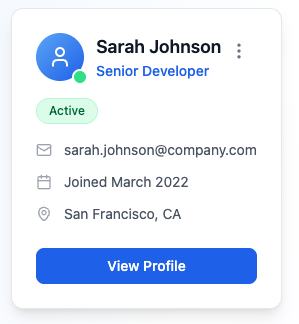
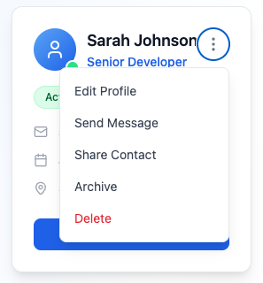

# Person Card Web Component

A reusable, accessible vanilla web component for displaying person information with interactive menu functionality. Built with TypeScript, Shadow DOM, and comprehensive keyboard navigation support.




## Features

- **Vanilla Web Component**: Pure TypeScript implementation using Shadow DOM for style isolation
- **Fully Accessible**: WCAG 2.1 AA compliant with complete keyboard navigation and screen reader support
- **Interactive Menu**: Dropdown menu with customizable actions (Edit, Message, Share, Archive, Delete)
- **Type Safety**: Built with TypeScript for robust development experience
- **Comprehensive Testing**: Full test suite using Vitest and Testing Library
- **Zero Dependencies**: No external runtime dependencies

## Installation

### Prerequisites

- Node.js 16+
- npm or yarn

### Setup

1. Clone the repository:

```bash
git clone <repository-url>
cd card-with-menu
```

2. Install dependencies:

```bash
npm install
```

3. Start the development server:

```bash
npm run dev
```

4. Open your browser to `http://localhost:5173`

## Usage

### Basic Implementation

```html
<!-- Include the component -->
<script type="module" src="./dist/person-card.js"></script>

<!-- Use the component -->
<person-card
  name="John Doe"
  role="Software Engineer"
  status="Active"
  email="john.doe@example.com"
  date-joined="2024-01-01"
  location="New York"
>
</person-card>
```

### Programmatic Usage

```javascript
// Create and configure the component
const personCard = document.createElement("person-card");
personCard.name = "Jane Smith";
personCard.role = "Product Manager";
personCard.status = "Active";
personCard.email = "jane.smith@example.com";
personCard.dateJoined = "2023-06-15";
personCard.location = "San Francisco";

// Append to DOM
document.body.appendChild(personCard);
```

### Event Handling

The component emits custom events for different interactions:

```javascript
const personCard = document.querySelector("person-card");

// Listen for profile view events
personCard.addEventListener("person-card:profile-viewed", (event) => {
  console.log("Profile viewed:", event.detail);
});

// Listen for menu item clicks
personCard.addEventListener("person-card:menu-item-clicked", (event) => {
  const { action, person } = event.detail;
  console.log(`Action: ${action}`, person);

  // Handle different actions
  switch (action) {
    case "edit":
      // Open edit modal
      break;
    case "message":
      // Open messaging interface
      break;
    case "delete":
      // Show confirmation dialog
      break;
    // ... other actions
  }
});
```

## Component API

### Attributes/Properties

| Attribute     | Property     | Type     | Required | Description                             |
| ------------- | ------------ | -------- | -------- | --------------------------------------- |
| `name`        | `name`       | `string` | ✅       | Person's full name                      |
| `role`        | `role`       | `string` | ✅       | Job title or role                       |
| `status`      | `status`     | `string` | ✅       | Status: "Active", "Inactive", or "Away" |
| `email`       | `email`      | `string` | ❌       | Email address                           |
| `date-joined` | `dateJoined` | `string` | ❌       | Date in YYYY-MM-DD format               |
| `location`    | `location`   | `string` | ❌       | Work location                           |

### Events

| Event Name                      | Detail               | Description                                 |
| ------------------------------- | -------------------- | ------------------------------------------- |
| `person-card:initialized`       | `{ person }`         | Fired when component is initialized         |
| `person-card:profile-viewed`    | `{ person }`         | Fired when "View Profile" button is clicked |
| `person-card:menu-toggled`      | `{ isOpen, person }` | Fired when menu is opened/closed            |
| `person-card:menu-item-clicked` | `{ action, person }` | Fired when a menu item is selected          |

### Menu Actions

- **Edit Profile**: `edit`
- **Send Message**: `message`
- **Share Contact**: `share`
- **Archive**: `archive`
- **Delete**: `delete`

## Accessibility Features

- Full keyboard navigation with Tab, Enter, Escape, and Arrow keys
- ARIA labels and roles for screen reader compatibility
- Focus management for menu interactions
- High contrast support
- Semantic HTML structure

### Keyboard Navigation

- `Tab`: Navigate between interactive elements
- `Enter/Space`: Activate buttons and menu items
- `Arrow Keys`: Navigate through menu items
- `Escape`: Close open menu

## Development

### Available Scripts

```bash
# Start development server
npm run dev

# Build for production
npm run build

# Preview production build
npm run preview

# Run tests
npm test

# Run tests with UI
npm run test:ui

# Run tests once
npm run test:run
```

### Project Structure

```
src/
├── components/           # Future additional components
├── styles/              # Global styles and CSS utilities
├── types/               # TypeScript type definitions
├── utils/               # Utility functions
│   ├── dateFormatter.ts # Date formatting utilities
│   └── sanitization.ts  # Input sanitization utilities
├── main.ts              # Demo application entry point
├── person-card.ts       # Main component implementation
├── person-card.test.ts  # Component tests
└── test-setup.ts        # Test configuration

tasks/                   # Project documentation
├── prd-person-card-component.md      # Product requirements
└── tasks-prd-person-card-component.md # Development tasks

ux-mocks/               # Design mockups
├── card-mock.png       # Basic card design
└── card-menu-mock.png  # Card with menu open
```

### Testing

The project uses Vitest with Testing Library for comprehensive testing:

```bash
# Run all tests
npm test

# Run tests in watch mode
npm run test:watch

# Run tests with coverage
npm test -- --coverage
```

Tests cover:

- Component rendering and data display
- Keyboard navigation and accessibility
- Menu interactions and event handling
- Input sanitization and validation
- Error handling and edge cases

### Architecture Decisions

- **Shadow DOM**: Ensures style isolation and prevents CSS conflicts
- **Vanilla Web Components**: No framework dependencies for maximum compatibility
- **TypeScript**: Type safety and better developer experience
- **Event-driven**: Uses custom events for loose coupling with parent applications
- **Sanitization**: All user inputs are sanitized for security

## Browser Support

- Chrome 53+
- Firefox 63+
- Safari 10.1+
- Edge 79+

## Contributing

1. Fork the repository
2. Create a feature branch: `git checkout -b feature/amazing-feature`
3. Make your changes and add tests
4. Ensure all tests pass: `npm test`
5. Commit your changes: `git commit -m 'Add amazing feature'`
6. Push to the branch: `git push origin feature/amazing-feature`
7. Open a Pull Request

## License

This project is licensed under the MIT License - see the LICENSE file for details.

## Security

- All user inputs are sanitized to prevent XSS attacks
- Shadow DOM provides style isolation
- No external dependencies reduce attack surface
- Input validation for all component properties

## Performance

- Lightweight (~15KB minified)
- Shadow DOM for efficient style scoping
- Event delegation for optimal memory usage
- Lazy rendering for large lists (when multiple components are used)
